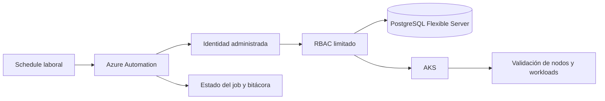

# Automatización horaria para optimización de costos en Azure

Réplica pública y anonimizada de una automatización de operaciones cloud que enciende y detiene un clúster AKS y una instancia de PostgreSQL Flexible Server según un horario laboral.

El objetivo es reducir consumo en ambientes de pruebas que no necesitan permanecer encendidos fuera de la jornada, manteniendo el orden correcto de dependencias y una recuperación verificable al siguiente inicio.

> **Nota de alcance:** este repositorio no contiene la implementación interna ni datos de una empresa. Los nombres, identificadores, horarios y valores son ficticios y sirven para demostrar el diseño técnico de forma segura.

## Problema

Un ambiente de pruebas con AKS y PostgreSQL puede seguir consumiendo recursos durante noches y fines de semana aunque no tenga usuarios trabajando. Apagar recursos manualmente depende de la memoria de una persona, genera pasos repetitivos y aumenta el riesgo de detener servicios en un orden incorrecto.

La dificultad no es solo ejecutar un `stop`: al iniciar, PostgreSQL debe estar disponible antes de que AKS recupere sus workloads; al detener, AKS debe bajar primero para no dejar aplicaciones intentando conectarse a una base de datos apagada.

## Solución propuesta

Una cuenta de Azure Automation con identidad administrada ejecuta un runbook parametrizado:

- `Start`: inicia PostgreSQL, espera el estado `Ready`, inicia AKS y valida la recuperación.
- `Stop`: detiene AKS, espera el estado detenido y luego detiene PostgreSQL.
- Los schedules usan la zona horaria `America/Santiago`.
- Las acciones se limitan al alcance de los recursos definidos para el ambiente.
- Cada ejecución debe dejar evidencia del job, estados finales, duración y errores.

## Arquitectura



Secuencias:

```text
Inicio:     PostgreSQL -> esperar Ready -> AKS -> validar workloads
Detención:  AKS -> esperar detenido -> PostgreSQL -> validar estados
```

## Alcance demostrable

- Automatización externa al clúster mediante Azure Automation.
- Identidad administrada sin credenciales persistidas.
- Parametrización de nombres, grupos de recursos y horarios.
- Validación de estados de PostgreSQL, AKS, nodos y deployments.
- Rollback operativo: deshabilitar schedules, iniciar manualmente en el orden correcto y mantener el ambiente encendido mientras se investiga.
- Comparación de consumo antes y después mediante Azure Cost Management.

## Estado del proyecto

| Parte | Estado |
|---|---|
| Diseño de la secuencia Start/Stop | Implementado y validado en el caso real de referencia |
| Prueba controlada del runbook | Validada en el caso real de referencia |
| Ejecución programada | Validada en el caso real de referencia |
| Réplica pública de código y documentación | En construcción |
| Evidencia de ahorro | Se documentará con datos agregados y sin información interna |

## Estructura

```text
automatizacion-costos-azure/
|-- docs/
|   |-- arquitectura.md
|   |-- validacion.md
|   `-- troubleshooting.md
|-- scripts/
|   `-- automatizacion-horaria.ps1
|-- .gitignore
`-- README.md
```

## Seguridad y límites

- No incluir suscripciones, tickets, nombres reales, GUID, dominios, kubeconfig, tokens ni cadenas de conexión.
- No apagar suscripciones completas ni Resource Groups compartidos.
- No modificar directamente el Resource Group administrado `MC_*`.
- Validar consumidores externos antes de programar una detención.
- Revisar si los roles integrados son más amplios de lo necesario y reemplazarlos por un rol personalizado cuando el contexto lo permita.

## Próximos pasos

1. Completar la réplica pública del runbook con variables ficticias.
2. Agregar validaciones y troubleshooting reproducibles.
3. Incorporar una captura o tabla de ahorro con datos agregados.
4. Enlazar el repositorio desde la página de proyectos del portafolio.
